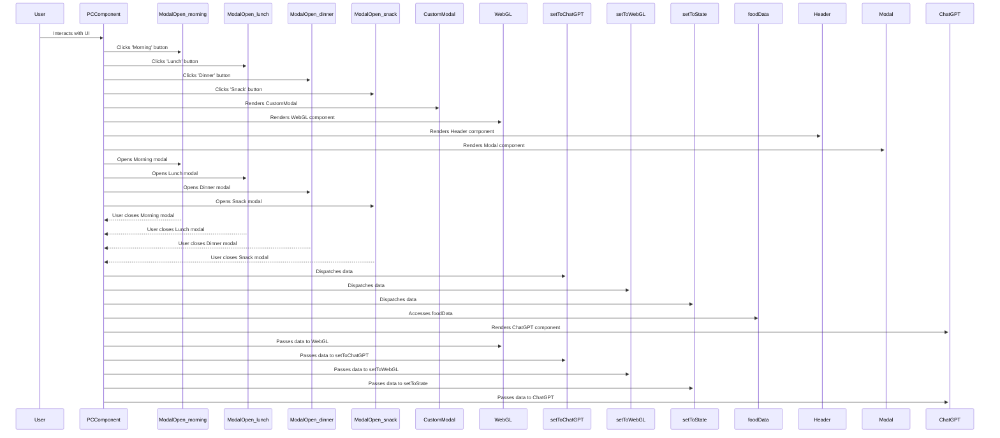

```mermaid
sequenceDiagram
participant User
participant PCComponent
participant ModalOpen_morning
participant ModalOpen_lunch
participant ModalOpen_dinner
participant ModalOpen_snack
participant CustomModal
participant WebGL
participant setToChatGPT
participant setToWebGL
participant setToState
participant foodData
participant Header
participant Modal
participant ChatGPT

User->>PCComponent: Interacts with UI
PCComponent->>+ModalOpen_morning: Clicks 'Morning' button
PCComponent->>+ModalOpen_lunch: Clicks 'Lunch' button
PCComponent->>+ModalOpen_dinner: Clicks 'Dinner' button
PCComponent->>+ModalOpen_snack: Clicks 'Snack' button
PCComponent->>CustomModal: Renders CustomModal
PCComponent->>+WebGL: Renders WebGL component
PCComponent->>+Header: Renders Header component
PCComponent->>+Modal: Renders Modal component
PCComponent->>ModalOpen_morning: Opens Morning modal
PCComponent->>ModalOpen_lunch: Opens Lunch modal
PCComponent->>ModalOpen_dinner: Opens Dinner modal
PCComponent->>ModalOpen_snack: Opens Snack modal
ModalOpen_morning-->>PCComponent: User closes Morning modal
ModalOpen_lunch-->>PCComponent: User closes Lunch modal
ModalOpen_dinner-->>PCComponent: User closes Dinner modal
ModalOpen_snack-->>PCComponent: User closes Snack modal
PCComponent->>+setToChatGPT: Dispatches data
PCComponent->>+setToWebGL: Dispatches data
PCComponent->>+setToState: Dispatches data
PCComponent->>foodData: Accesses foodData
PCComponent->>+ChatGPT: Renders ChatGPT component
PCComponent->>WebGL: Passes data to WebGL
PCComponent->>setToChatGPT: Passes data to setToChatGPT
PCComponent->>setToWebGL: Passes data to setToWebGL
PCComponent->>setToState: Passes data to setToState
PCComponent->>ChatGPT: Passes data to ChatGPT
```
